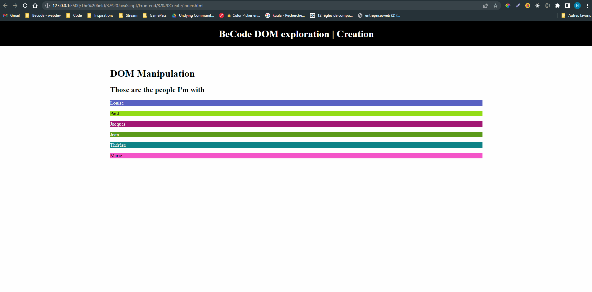

# BeCode Formation Repo

This repository contains exercises and projects completed during the BeCode formation. The repo is divided into three main categories:

- [The Field](https://github.com/NadegeHbg/BeCode-exercices/tree/main/The%20field)
- [The Hill](https://github.com/NadegeHbg/BeCode-exercices/tree/main/The%20hill)
- The Mountain

## The Field

In the [field](https://github.com/NadegeHbg/BeCode-exercices/tree/main/The%20field), we covered the basics of web development, including:

- [Markdown](./The%20field/1.%20Markdown)
- [HTML & CSS](./The%20field/2.%20HTML%20%26%20CSS), where I completed [integration exercises](./The%20field/2.%20HTML%20%26%20CSS/1.%20Integration), worked on [responsiveness](./The%20field/2.%20HTML%20%26%20CSS/2.%20Responsiveness), and discovered SASS
- [JavaScript](./The%20field/3.%20JavaScript), where we worked with DOM manipulation in the front-end and Node.js/Express.js in the back-end.

## The Hill

In the [hill](https://github.com/NadegeHbg/BeCode-exercices/tree/main/The%20hill), we consolidated our knowledge and skills in both front-end and back-end development. Specifically:

- [Frontend Sprint](https://github.com/NadegeHbg/BeCode-exercices/tree/main/The%20hill/1.%20Frontend-sprint):
  - Worked with timeouts and intervals
  - Worked with dates
  - Worked with async and intervals
- [Backend Sprint](https://github.com/NadegeHbg/BeCode-exercices/tree/main/The%20hill/2.%20Backend-sprint):
  - Learned PostgreSQL
  - Learned MongoDB
  - Learned data management

## The Mountain

In the [mountain](https://github.com/NadegeHbg/BeCode-exercices/tree/main/The%20Moutain), I started to learn React.

### Technologies Used

- HTML
- CSS
- JavaScript
- SASS
- Node.js
- Express.js
- PostgreSQL
- MongoDB
- React

## Here are some previews of what I did

### Playing with event listeners

### First integration's exercise

### Second integration's exercise

### Quick exercise to play with randomisation and with automatisation of contrast between text and background color

> Feel free to browse the repository and explore the code!
